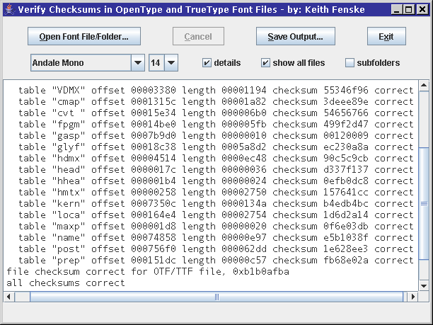

### Font Checksum (Java)

by: Keith Fenske, https://kwfenske.github.io/

FontChecksum is a Java 1.4 application to verify the internal checksums of
OpenType (OTF) and TrueType (TTC, TTF) font files. Sometimes when you download
a file, or copy a file from a worn CD/DVD, what you receive differs from the
original. After downloading or copying twice, you may have two files with the
same size, the same date, and the same apparent contents. When compared
byte-by-byte with commands such as "comp" on DOS/Windows or "cmp" on Linux,
only a few bits or bytes are different. The rest of the files are the same.
Your question is which file is correct. One of them must be wrong. (Both could
be wrong!) Since font files contain internal checksums, you can use this
information to test which of the files is more correct. Note that freeware and
shareware fonts produced with older font tools often have numerous checksum
errors.

Download the ZIP file here: https://kwfenske.github.io/font-checksum-java.zip

Released under the terms and conditions of the Apache License (version 2.0 or
later) and/or the GNU General Public License (GPL, version 2 or later).

